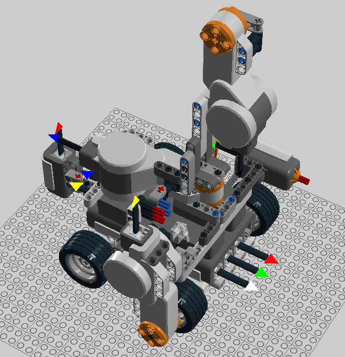

# tagbot

`tagbot` is a [LEGO Mindstorms NXT](https://en.wikipedia.org/wiki/Lego_Mindstorms_NXT) robot for testing passive integrated transponder (PIT) tags and readers, controlled using python scripts.  `tagbot` was implemented by [Trident Systems](https://www.tridentsystems.co.nz/) for testing tags and readers for use in fish tagging programmes that aim to estimate stock abundance using mark-recapture methods.

Two different robots have been implemented, `approach` and `scan`.

## approach testing

The `approach` testing robot is designed to test tag detection distance with the tag presented to the antenna in different orientations.  The robot carries the tag horizontally towards a vertically mounted antenna.  This facilites grid testing of detection distance across the surface of the antenna.

## scan testing

The `scan` testing robot carries a tag at different heights across a horizontally mounted antenna.  This is intended to simulate the scanning of a fish over an antenna incorporated in a catch sorting table.

## Requirements

The robot building instructions are given in LXF files.  These can be viewed in [LEGO Digital Designer](http://ldd.lego.com/), a free application for Windows or Mac.  It may also be possible to view these with the [BricksViewer](http://bricksviewer.sourceforge.net/) Java app.

The LXF files only show the mounting point for the distance sensor, which was a High Precision Medium Range Infrared distance sensor (DIST-NxM-v2; http://www.mindsensors.com).

The robot controller scripts run on Linux systems and communicate with the NXT brick via USB.  In addition the scripts expect a [Biomark](https://www.biomark.com) IS1001 tag reader] to provide tag readings via USB.

## Installation

On Ubuntu linux flavours, install the `python-nxt` and `python-usb` packages.

Install `python-usb` using your distribution's package manager, then follow the instructions beginning "For USB communications ..." at https://github.com/Eelviny/nxt-python/wiki/Installation to set permissions etc.

## Use

To communicate with the tag reader, the program must be run with elevated permission. i.e. sudo.

The `approach` tagbot expects two command line parameters: a tag ID and a grid position:

`sudo approach.py <tagID> <gridID>`

The `scan` tagbot expects a single command line parameter: a tag ID:

`sudo scan.py <tagID>`

The tag ID and grid parameters are freeform text values that are included in the output of the scripts (on stdout) to assist in keeping track of testing runs.  For example the <gridID> could be of the form xx.yy to identify the position on the surface of the antenna where the tag is being presented.
